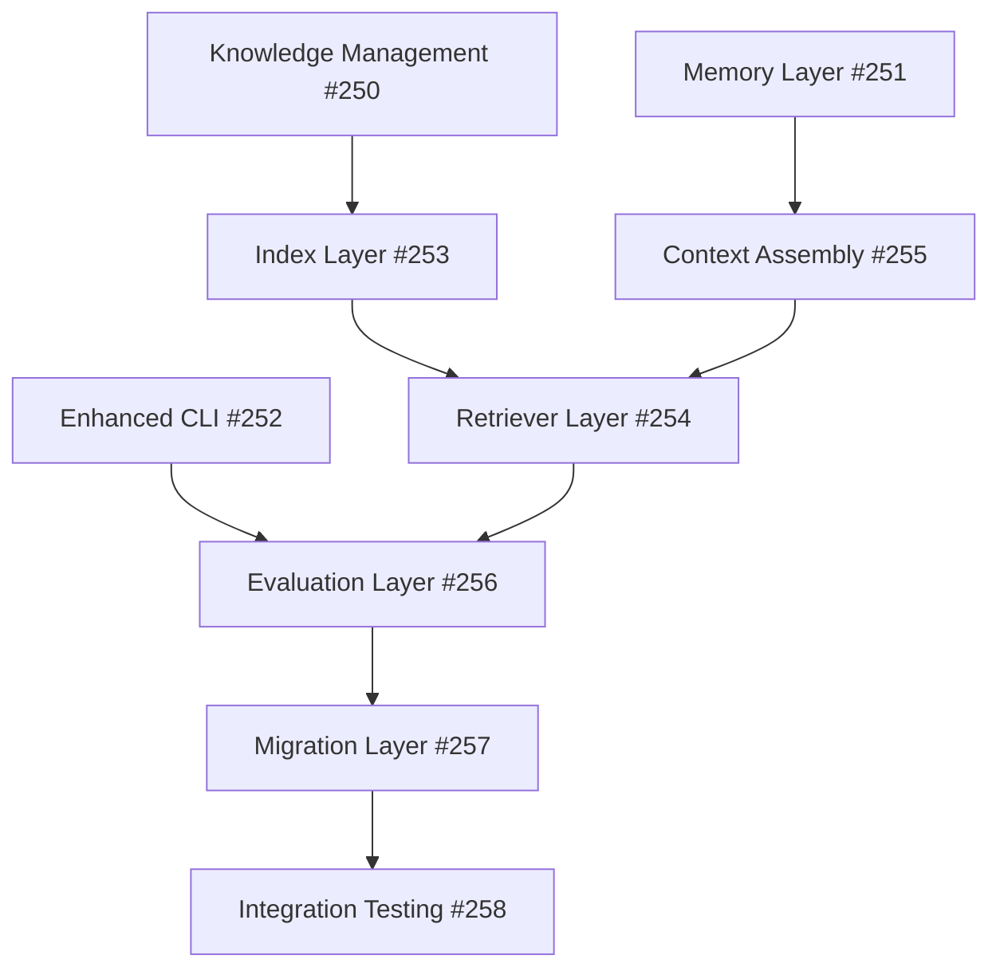

# FF2 Implementation Roadmap
## 12-Week Execution Timeline

---

## 📅 Milestone Timeline

### **🏗️ Phase 1: Foundation Layer (Weeks 1-4)**

#### **Week 1: Architecture & Design**
- **Monday**: Issue #250 - Knowledge Management System design
- **Tuesday**: Issue #251 - Memory Layer architecture  
- **Wednesday**: Database schema design and validation
- **Thursday**: CLI command framework extension
- **Friday**: Phase 1 design review and validation

#### **Week 2: Core Implementation**  
- **Monday-Tuesday**: Knowledge card storage implementation
- **Wednesday-Thursday**: Memory persistence system
- **Friday**: Integration testing and validation

#### **Week 3: CLI & Integration**
- **Monday-Tuesday**: Enhanced CLI commands (`ff2 learn`, `ff2 retrieve`)
- **Wednesday-Thursday**: Knowledge-memory integration
- **Friday**: End-to-end testing

#### **Week 4: Foundation Completion**
- **Monday-Tuesday**: Issue #252 - CLI enhancement completion
- **Wednesday-Thursday**: Documentation and user guides
- **Friday**: Phase 1 quality gates and sign-off

**Phase 1 Deliverables:**
- ✅ Working knowledge management system
- ✅ Persistent job memory
- ✅ Enhanced CLI with learning commands
- ✅ Zero breaking changes verified

---

### **🧠 Phase 2: Intelligence Layer (Weeks 5-8)**

#### **Week 5: Indexing Foundation**
- **Monday**: Issue #253 - SQLite FTS5 integration start
- **Tuesday-Wednesday**: Full-text search implementation
- **Thursday-Friday**: Search optimization and testing

#### **Week 6: Advanced Indexing**
- **Monday-Tuesday**: Vector indexing preparation (Qdrant/pgvector)
- **Wednesday-Thursday**: Hybrid search implementation
- **Friday**: Performance benchmarking (<500ms target)

#### **Week 7: Adaptive Retrieval**
- **Monday**: Issue #254 - Bandit algorithm implementation
- **Tuesday-Wednesday**: Feature extraction system
- **Thursday-Friday**: ML re-ranking system (optional)

#### **Week 8: Context Assembly**
- **Monday**: Issue #255 - Context pack assembler
- **Tuesday-Wednesday**: Token budget enforcement
- **Thursday-Friday**: Agent-specific templates and testing

**Phase 2 Deliverables:**
- ✅ Sub-500ms search for 50k+ files
- ✅ Adaptive learning system operational
- ✅ Context packs auto-generated (≤5k tokens)
- ✅ 30% improvement in context relevance

---

### **📊 Phase 3: Learning & Deployment (Weeks 9-12)**

#### **Week 9: Evaluation Systems**
- **Monday**: Issue #256 - Job outcome tracking
- **Tuesday-Wednesday**: Learning effectiveness metrics
- **Thursday-Friday**: Knowledge promotion algorithms

#### **Week 10: Migration & Compatibility**  
- **Monday**: Issue #257 - Backward compatibility layer
- **Tuesday-Wednesday**: Migration utilities and scripts
- **Thursday-Friday**: Feature flag system implementation

#### **Week 11: Integration Testing**
- **Monday**: Issue #258 - Comprehensive E2E testing
- **Tuesday-Wednesday**: Security audit and performance validation
- **Thursday-Friday**: User acceptance testing

#### **Week 12: Final Deployment**
- **Monday-Tuesday**: Production readiness validation
- **Wednesday**: Deployment automation setup
- **Thursday**: Documentation finalization
- **Friday**: Go-live and monitoring setup

**Phase 3 Deliverables:**
- ✅ System learns and improves over time
- ✅ Seamless migration for existing users  
- ✅ >95% test coverage maintained
- ✅ All quality gates passing

---

## 🎯 Critical Path Dependencies



**Parallel Execution Opportunities:**
- Week 1-2: Issues #250, #251, #252 (parallel)
- Week 5-6: Issue #253 (independent)
- Week 7-8: Issues #254, #255 (parallel after #253)
- Week 9-10: Issues #256, #257 (parallel)
- Week 11-12: Issue #258 (depends on all)

---

## 🚀 Agent Assignment Matrix

| Issue | Primary Agent | Secondary Agent | Support Agent | Timeline |
|-------|---------------|-----------------|---------------|----------|
| #250 | system-architect | code-implementer | test-coverage-validator | Week 1-2 |
| #251 | database-architect | code-implementer | test-coverage-validator | Week 2-3 |
| #252 | code-implementer | documentation-generator | test-coverage-validator | Week 3-4 |
| #253 | database-architect | performance-optimizer | code-implementer | Week 5-6 |
| #254 | performance-optimizer | system-architect | code-implementer | Week 6-7 |
| #255 | system-architect | code-implementer | performance-optimizer | Week 7-8 |
| #256 | performance-optimizer | system-architect | code-implementer | Week 9-10 |
| #257 | deployment-automation | code-quality-reviewer | documentation-generator | Week 10-11 |
| #258 | test-coverage-validator | security-auditor | performance-optimizer | Week 11-12 |

---

## 📊 Weekly Checkpoints & KPIs

### **Weekly Review Metrics:**
- **Code Quality**: TypeScript errors = 0, ESLint warnings = 0
- **Test Coverage**: Must maintain >95% throughout
- **Performance**: No regression in existing features
- **Documentation**: All new features documented
- **Security**: No new vulnerabilities introduced

### **Phase Gate Reviews:**
1. **Phase 1 Gate (Week 4)**: Foundation components functional
2. **Phase 2 Gate (Week 8)**: Intelligence layer operational  
3. **Phase 3 Gate (Week 12)**: Full system ready for production

### **Success Criteria Tracking:**
- **Week 4**: Knowledge + Memory systems functional
- **Week 8**: 30% context relevance improvement achieved
- **Week 12**: 50% faster agent startup demonstrated

---

## 🛡️ Risk Monitoring & Mitigation

### **Weekly Risk Assessment:**

#### **Weeks 1-4 Risks:**
- **Risk**: Knowledge schema complexity
- **Mitigation**: Start simple, iterate
- **Monitor**: Schema validation performance

#### **Weeks 5-8 Risks:**  
- **Risk**: Search performance degradation
- **Mitigation**: Continuous benchmarking
- **Monitor**: <500ms search target

#### **Weeks 9-12 Risks:**
- **Risk**: Migration complexity
- **Mitigation**: Feature flags, gradual rollout
- **Monitor**: User feedback and error rates

---

## 🔄 Continuous Integration Pipeline

### **Per-Commit Validation:**
```bash
npm run validate  # typecheck + lint + test
npm run security  # security audit  
npm run benchmark # performance validation
```

### **Weekly Integration:**
```bash
npm run test:e2e           # End-to-end testing
npm run test:performance   # Performance regression testing
npm run test:compatibility # Backward compatibility validation
```

### **Phase Gate Validation:**
```bash
npm run test:full          # Complete test suite
npm run audit:security     # Comprehensive security audit
npm run benchmark:full     # Full performance benchmark suite
```

---

## 🎉 Success Celebration Milestones

### **Phase 1 Success (Week 4):**
- 🎊 First context-aware agent execution
- 📝 Knowledge card successfully created and retrieved
- ⚡ Enhanced CLI commands operational

### **Phase 2 Success (Week 8):**
- 🧠 First adaptive weight adjustment observed
- 🔍 Sub-500ms search performance achieved
- 📦 Context packs auto-generated successfully

### **Phase 3 Success (Week 12):**
- 🚀 Full FF2 enhanced system operational
- 📈 Learning effectiveness measurable
- ✨ Backward compatibility maintained 100%

---

**Next Actions in GFG Mode:**
1. Begin Issue #250 with system-architect agent
2. Parallel start Issue #251 with database-architect agent
3. Monitor progress through GitHub issue updates
4. Execute quality gates at each milestone
5. Continue autonomous operation until `gfg stop`

*All agents authorized to proceed with implementation following zero-tolerance quality standards.*