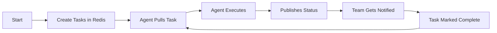

# 🔧 ForgeFlow Self-Implementation Plan
## "ForgeFlow Fixing ForgeFlow" - A Meta Implementation

### 🎯 **Mission Statement**
Use ForgeFlow's intended architecture to implement its missing features, proving the system works by having it fix itself.

---

## 📋 **Task Breakdown Structure**

### **EPIC: Make ForgeFlow Production Ready**
**Timeline**: 3 Days  
**Method**: Use ForgeFlow's task queue to coordinate the implementation

```yaml
Epic: ForgeFlow-Self-Implementation
  ├── Phase-1: Foundation (Day 1)
  │   ├── Task-1.1: Create Task Queue System
  │   ├── Task-1.2: Build Agent-Redis Connector
  │   └── Task-1.3: Implement Basic Monitoring
  │
  ├── Phase-2: Integration (Day 2)
  │   ├── Task-2.1: Wire Agents to Redis
  │   ├── Task-2.2: Add Notification System
  │   └── Task-2.3: Create Persistence Layer
  │
  └── Phase-3: Polish (Day 3)
      ├── Task-3.1: Build Web Dashboard
      ├── Task-3.2: Add Error Recovery
      └── Task-3.3: Create Documentation
```

---

## 🔨 **Phase 1: Foundation (Day 1)**

### Task 1.1: Create Task Queue System
**Priority**: P0  
**Duration**: 3 hours  
**Agent**: System Architect

```javascript
// Implementation structure
ForgeFlow-v2-FF2/
├── src/
│   └── orchestrator/
│       ├── task-queue.ts       // Core queue logic
│       ├── task-processor.ts   // Task execution
│       └── task-monitor.ts     // Queue monitoring
```

**Deliverables**:
- Redis-based task queue
- Task priority system
- Atomic task claiming
- Task status tracking

### Task 1.2: Build Agent-Redis Connector
**Priority**: P0  
**Duration**: 3 hours  
**Agent**: Code Implementer

```typescript
// Agent connector interface
interface AgentRedisConnector {
  publishStatus(status: AgentStatus): Promise<void>
  subscribeToTasks(agentType: string): Promise<void>
  reportProgress(taskId: string, progress: number): Promise<void>
  handleError(error: Error): Promise<void>
}
```

**Deliverables**:
- Base agent Redis integration
- Auto-status publishing
- Progress reporting
- Error propagation

### Task 1.3: Implement Basic Monitoring
**Priority**: P1  
**Duration**: 2 hours  
**Agent**: UI/UX Optimizer

```javascript
// Terminal monitoring interface
┌─────────────────────────────────────────┐
│ ForgeFlow Monitor v2.0                 │
├─────────────────────────────────────────┤
│ Active Agents: 3                       │
│ Tasks in Queue: 12                     │
│ Completed Today: 45                    │
├─────────────────────────────────────────┤
│ [11:23:45] CodeReviewer: Analyzing PR  │
│ [11:23:46] TestRunner: Running tests   │
│ [11:23:47] Deployer: Preparing build   │
└─────────────────────────────────────────┘
```

---

## 🔌 **Phase 2: Integration (Day 2)**

### Task 2.1: Wire Agents to Redis
**Priority**: P0  
**Duration**: 4 hours  
**Agent**: Code Implementer + System Architect

**Implementation Files**:
1. `src/agents/redis-enabled-agent.ts`
2. `src/agents/agent-orchestrator.ts`
3. `src/config/redis-channels.ts`

### Task 2.2: Add Notification System
**Priority**: P1  
**Duration**: 2 hours  
**Agent**: Performance Optimizer

**Notification Types**:
- Task started/completed
- Build success/failure
- Agent errors
- System alerts

### Task 2.3: Create Persistence Layer
**Priority**: P1  
**Duration**: 2 hours  
**Agent**: Database Architect

**Storage Structure**:
```redis
ff2:tasks:history        - Sorted set of completed tasks
ff2:agents:metrics       - Hash of agent performance
ff2:team:activity        - List of team actions
ff2:audit:log           - Compliance audit trail
```

---

## 🎨 **Phase 3: Polish (Day 3)**

### Task 3.1: Build Web Dashboard
**Priority**: P2  
**Duration**: 4 hours  
**Agent**: UI/UX Optimizer

### Task 3.2: Add Error Recovery
**Priority**: P1  
**Duration**: 2 hours  
**Agent**: Security Auditor

### Task 3.3: Create Documentation
**Priority**: P2  
**Duration**: 2 hours  
**Agent**: Strategic Planner

---

## 📊 **Success Metrics**

| Metric | Target | Measurement |
|--------|--------|-------------|
| Task Distribution Speed | <100ms | Redis latency |
| Agent Utilization | >80% | Active time/Total time |
| Notification Delivery | <1s | Pub/Sub timing |
| System Uptime | 99.9% | Health checks |
| Task Success Rate | >95% | Completed/Total |

---

## 🚦 **Implementation Sequence**



---

## 🔄 **Meta-Implementation Process**

This plan will be implemented BY ForgeFlow USING ForgeFlow:

1. **Load tasks into Redis queue**
2. **Agents pull and execute tasks**
3. **Progress published to team channel**
4. **Monitoring shows real-time progress**
5. **System improves itself iteratively**

---

## 📝 **Task Format for Redis**

```json
{
  "id": "task_1756210592837",
  "type": "implementation",
  "priority": 0,
  "title": "Create Task Queue System",
  "description": "Build Redis-based task queue with atomic operations",
  "assignedAgent": "system-architect",
  "status": "pending",
  "createdAt": "2025-08-26T14:30:00Z",
  "dependencies": [],
  "subtasks": [
    "Design queue structure",
    "Implement FIFO/Priority logic",
    "Add atomic claiming",
    "Create monitoring hooks"
  ],
  "acceptance": {
    "tests": ["Queue operations are atomic", "No task duplication"],
    "performance": ["<100ms task claim time"],
    "documentation": ["API docs complete"]
  }
}
```

---

## 🎯 **The Demo Scenario**

**Live demonstration of ForgeFlow fixing itself:**

1. PM creates implementation tasks
2. Tasks auto-distribute to agents
3. Agents work in parallel
4. Progress visible in real-time
5. Notifications on completion
6. System becomes self-sustaining

**This proves ForgeFlow works by using ForgeFlow to build ForgeFlow!**