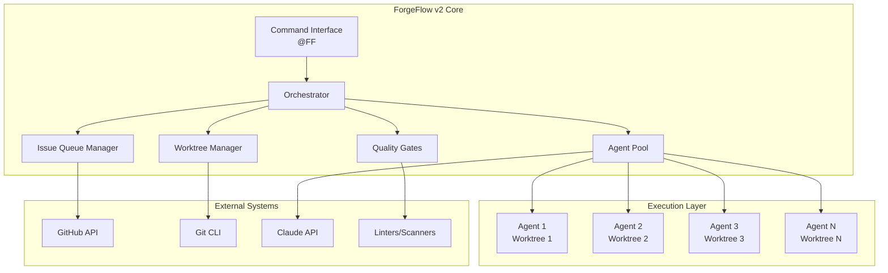
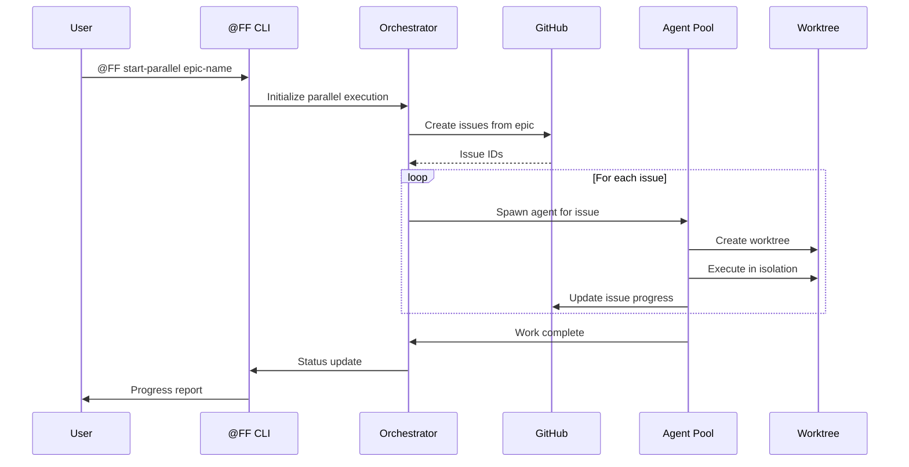

# Product Requirements Document: ForgeFlow v2
## True Parallel AI Orchestration System

**Version:** 2.0.0  
**Date:** December 2024  
**Status:** Draft  
**Authors:** ForgeFlow Team  

---

## 1. Executive Summary

### 1.1 Problem Statement
Current AI development orchestration systems suffer from fundamental limitations:
- **ForgeFlow v1** executes agents sequentially despite claiming parallelism, creating bottlenecks
- **Context pollution** occurs when multiple agents share the same workspace
- **No persistent state** between development sessions leads to context loss
- **Limited visibility** into parallel work streams for team members
- **Manual coordination** required for complex multi-agent workflows

### 1.2 Solution Overview
ForgeFlow v2 is a revolutionary AI orchestration system that achieves **true parallel execution** by combining:
- GitHub Issues as a distributed task queue
- Git worktrees for isolated execution environments  
- Specialized AI agents with defined capabilities
- Zero-tolerance quality gates
- Real-time progress visibility

### 1.3 Key Benefits
- **10x faster execution** through true parallelism
- **Zero context pollution** via worktree isolation
- **100% traceability** through GitHub integration
- **Team-scale collaboration** with real-time visibility
- **Enterprise-grade quality** with automated gates

---

## 2. Market Analysis

### 2.1 Target Users

#### Primary Users
- **Senior Developers** managing complex codebases
- **Tech Leads** coordinating AI-assisted development
- **DevOps Engineers** automating deployment pipelines
- **Open Source Maintainers** scaling contribution handling

#### Secondary Users  
- **Product Managers** tracking development progress
- **QA Engineers** ensuring code quality
- **Junior Developers** learning from AI patterns
- **Enterprise Teams** requiring audit trails

### 2.2 Competitive Analysis

| System | Parallel Execution | Context Preservation | Team Visibility | Quality Gates |
|--------|-------------------|---------------------|-----------------|---------------|
| ForgeFlow v1 | ❌ Sequential | ❌ Limited | ❌ None | ✅ Strong |
| CCPM | ✅ Via worktrees | ✅ GitHub Issues | ✅ Full | ❌ Basic |
| Cursor AI | ❌ Single thread | ❌ Session only | ❌ None | ❌ None |
| Copilot Workspace | ⚠️ Limited | ⚠️ Partial | ✅ GitHub | ⚠️ Basic |
| **ForgeFlow v2** | ✅ True parallel | ✅ Persistent | ✅ Real-time | ✅ Zero-tolerance |

### 2.3 Market Opportunity
- **$2.3B** AI coding assistant market by 2025
- **73%** of enterprises adopting AI development tools
- **Critical gap:** No solution offers true parallel orchestration with quality enforcement

---

## 3. Product Requirements

### 3.1 Functional Requirements

#### 3.1.1 Core Orchestration

**FR-001: Parallel Task Execution**
- System SHALL spawn multiple AI agents simultaneously in isolated environments
- Each agent SHALL work in a dedicated Git worktree
- Agents SHALL NOT block each other's execution
- System SHALL support minimum 10 parallel agents

**FR-002: GitHub Issue Integration**  
- System SHALL use GitHub Issues as the task queue
- Each issue SHALL map to exactly one work stream
- Issue labels SHALL determine agent assignment
- Issue comments SHALL track progress in real-time

**FR-003: Agent Management**
- System SHALL maintain a pool of specialized agents
- Agents SHALL be assigned based on task requirements
- System SHALL support custom agent definitions
- Agent capabilities SHALL be versioned and tracked

**FR-004: Quality Gates**
- System SHALL enforce zero-tolerance quality standards
- ALL code SHALL pass linting with 0 errors, 0 warnings
- Test coverage SHALL exceed 95%
- Security scans SHALL find 0 vulnerabilities
- Performance benchmarks SHALL be met

#### 3.1.2 Command Interface

**FR-005: Unified Command System**
- Commands SHALL use @FF prefix
- System SHALL support emergency mode (@FF!)
- Commands SHALL be discoverable via @FF help
- System SHALL provide command autocomplete

**FR-006: Status Monitoring**
- System SHALL provide real-time execution status
- Progress SHALL be visible in GitHub UI
- System SHALL generate progress reports
- Blocked tasks SHALL be highlighted

#### 3.1.3 Workflow Patterns

**FR-007: Predefined Patterns**
- System SHALL support pattern-based execution
- Patterns SHALL be configurable via YAML
- Common patterns SHALL be included:
  - Feature Development
  - Bug Fix Sprint  
  - Performance Optimization
  - Security Audit
  - Refactoring

**FR-008: Custom Workflows**
- Users SHALL define custom execution patterns
- Workflows SHALL support conditional logic
- Workflows SHALL be shareable across teams

### 3.2 Non-Functional Requirements

#### 3.2.1 Performance

**NFR-001: Execution Speed**
- Parallel tasks SHALL start within 5 seconds
- Agent spawning SHALL take <2 seconds
- Status queries SHALL return in <500ms
- System SHALL handle 50+ concurrent agents

**NFR-002: Scalability**
- System SHALL scale horizontally
- Performance SHALL not degrade with task count
- System SHALL support distributed execution

#### 3.2.2 Reliability

**NFR-003: Fault Tolerance**
- System SHALL recover from agent failures
- Work SHALL be resumable after interruption
- State SHALL persist across sessions
- System SHALL retry failed operations

**NFR-004: Data Integrity**
- No work SHALL be lost
- Conflicts SHALL be detected and resolved
- Audit trail SHALL be immutable

#### 3.2.3 Usability

**NFR-005: Developer Experience**
- Setup SHALL take <5 minutes
- Commands SHALL be intuitive
- Documentation SHALL be comprehensive
- Error messages SHALL be actionable

**NFR-006: Team Collaboration**
- Multiple users SHALL work simultaneously
- Changes SHALL be visible in real-time
- Handoffs SHALL be seamless
- Context SHALL be preserved

### 3.3 Technical Requirements

#### 3.3.1 Architecture

**TR-001: System Components**
```
- Orchestrator Core (Python)
- GitHub API Client
- Git Worktree Manager
- Agent Pool Coordinator
- Quality Gate Enforcer
- Command Line Interface
```

**TR-002: Integration Points**
- GitHub API v4 (GraphQL)
- Git CLI (worktree commands)
- Language-specific linters
- Test frameworks
- Security scanners

#### 3.3.2 Agent Specifications

**TR-003: Agent Types**
```yaml
Coordinator Agents:
  - orchestrator: Manages parallel execution
  - issue-analyzer: Determines work streams
  - conflict-resolver: Handles merge conflicts

Specialist Agents:
  - strategic-planner: Creates implementation plans
  - system-architect: Designs system architecture
  - code-implementer: Writes production code
  - test-coverage-validator: Ensures 95% coverage
  - security-auditor: Scans for vulnerabilities
  - performance-optimizer: Optimizes performance
  - ui-ux-optimizer: Improves user interfaces
  - database-architect: Designs data models
  - deployment-automation: Manages CI/CD

Support Agents:
  - documentation-generator: Creates docs
  - code-reviewer: Reviews code quality
  - dependency-updater: Updates packages
```

---

## 4. User Stories

### 4.1 Epic: Parallel Feature Development

**User Story 1: Start Parallel Development**
```
AS A senior developer
I WANT TO execute multiple development tasks in parallel
SO THAT I can deliver features 10x faster
```

**Acceptance Criteria:**
- Can start 5+ agents simultaneously
- Each agent works in isolation
- No context pollution between agents
- Progress visible in real-time

**User Story 2: Monitor Progress**
```
AS A tech lead
I WANT TO see real-time progress of all parallel work
SO THAT I can identify and resolve blockers quickly
```

**Acceptance Criteria:**
- Dashboard shows all active agents
- Blocked tasks are highlighted
- Can drill down into specific issues
- Metrics are updated live

### 4.2 Epic: Quality Enforcement

**User Story 3: Zero-Error Guarantee**
```
AS A quality engineer
I WANT TO enforce zero-tolerance quality gates
SO THAT only perfect code reaches production
```

**Acceptance Criteria:**
- 0 linting errors allowed
- 95% test coverage required
- Security scan must pass
- Performance benchmarks met

---

## 5. Success Metrics

### 5.1 Adoption Metrics
- **Week 1:** 100 developers using system
- **Month 1:** 1,000 active users
- **Quarter 1:** 10,000 daily active users
- **Year 1:** 100,000 registered users

### 5.2 Performance Metrics
- **10x faster** feature delivery vs sequential execution
- **95% reduction** in context switching overhead
- **100% quality** gate pass rate
- **<5 min** average time to start parallel work

### 5.3 Quality Metrics
- **0 production bugs** from AI-generated code
- **>95% test coverage** across all projects
- **0 security vulnerabilities** in shipped code
- **100% linting compliance** 

---

## 6. Technical Design

### 6.1 System Architecture



### 6.2 Data Flow



---

## 7. Implementation Roadmap

### Phase 1: Foundation (Week 1-2)
- [ ] Core orchestrator implementation
- [ ] GitHub API integration
- [ ] Basic worktree manager
- [ ] Command line interface

### Phase 2: Agent System (Week 3-4)
- [ ] Port ForgeFlow v1 agents
- [ ] Implement agent pool coordinator
- [ ] Add CCPM context patterns
- [ ] Create coordinator agents

### Phase 3: Quality Framework (Week 5-6)
- [ ] Zero-tolerance validator
- [ ] Automated gate enforcement
- [ ] Performance benchmarks
- [ ] Security scanning integration

### Phase 4: Advanced Features (Week 7-8)
- [ ] Custom workflow patterns
- [ ] Distributed execution
- [ ] Advanced monitoring
- [ ] Team collaboration features

### Phase 5: Polish & Launch (Week 9-10)
- [ ] Documentation
- [ ] Testing & debugging
- [ ] Performance optimization
- [ ] Public release

---

## 8. Risks & Mitigations

| Risk | Impact | Probability | Mitigation |
|------|--------|-------------|------------|
| GitHub API rate limits | High | Medium | Implement caching, batch operations |
| Worktree conflicts | Medium | Low | Automated conflict resolution |
| Agent failures | Medium | Medium | Retry logic, fallback agents |
| Context size limits | High | Low | Context compression, chunking |
| Adoption resistance | High | Medium | Migration tools, training |

---

## 9. Open Questions

1. **Pricing Model:** Free tier limits? Enterprise pricing?
2. **Cloud Execution:** Support cloud-based agent execution?
3. **IDE Integration:** VS Code extension? JetBrains plugin?
4. **Multi-repo Support:** Handle monorepos and multi-repo projects?
5. **Custom LLMs:** Support for private/custom language models?

---

## 10. Appendices

### A. Glossary
- **Agent:** Specialized AI assistant for specific tasks
- **Worktree:** Isolated Git working directory
- **Quality Gate:** Automated code quality check
- **Orchestrator:** Core system managing parallel execution
- **Issue Queue:** GitHub Issues used as task queue

### B. References
- [CCPM Documentation](https://github.com/automazeio/ccpm)
- [ForgeFlow v1 Specification](internal)
- [GitHub API Documentation](https://docs.github.com/en/graphql)
- [Git Worktree Documentation](https://git-scm.com/docs/git-worktree)

---

**Document Status:** Ready for Review  
**Next Steps:** Technical design review, stakeholder approval