# Product Requirements Document: ForgeFlow v2
## True Parallel AI Orchestration System with Enterprise Protocols

**Version:** 2.0.0  
**Date:** December 2024  
**Status:** Complete Specification  
**Authors:** ForgeFlow Team  

---

## 1. Executive Summary

### 1.1 Problem Statement
Current AI development orchestration systems suffer from fundamental limitations:
- **ForgeFlow v1** executes agents sequentially despite claiming parallelism, creating bottlenecks
- **Context pollution** occurs when multiple agents share the same workspace
- **No persistent state** between development sessions leads to context loss
- **Limited visibility** into parallel work streams for team members
- **Manual coordination** required for complex multi-agent workflows
- **Hallucination risks** from AI suggesting non-existent code
- **Quality drift** without enforced standards

### 1.2 Solution Overview
ForgeFlow v2 is a revolutionary AI orchestration system that achieves **true parallel execution** with **zero-tolerance quality enforcement** by combining:
- GitHub Issues as a distributed task queue
- Git worktrees for isolated execution environments  
- Specialized AI agents with defined capabilities and protocols
- Mandatory safety protocols (NLNH, AntiHall, RYR)
- Zero-tolerance quality gates with automated enforcement
- Real-time progress visibility and audit trails

### 1.3 Key Benefits
- **10x faster execution** through true parallelism
- **Zero context pollution** via worktree isolation
- **100% traceability** through GitHub integration
- **Zero hallucinations** via AntiHall protocol
- **100% truth guarantee** via NLNH protocol
- **Team-scale collaboration** with real-time visibility
- **Enterprise-grade quality** with automated gates

---

## 2. Core Protocols & Rules

### 2.1 Mandatory Safety Protocols

#### 2.1.1 RYR (Remember Your Rules) Protocol
**Activation**: "Remember Your Rules", "RYR", "ryr"  
**Purpose**: Universal rules enforcement and compliance check

**Execution**:
```python
# Automatic trigger on any RYR command
python "C:\Jarvis\RYR_COMMAND.py"
```

**Enforcement Actions**:
1. Load ALL rules from CLAUDE.md and RULES.md files
2. Display PLAYWRIGHT_TESTING_PROTOCOL.md requirements
3. Check Docker agents and Archon integration status
4. Activate NLNH (No Lies, No Hallucination) protocol
5. Show Zero Tolerance Policy enforcement status
6. Provide color-coded compliance summary

#### 2.1.2 NLNH Protocol (No Lies, No Hallucination)
**Activation**: "NLNH" command or automatic on session start  
**Purpose**: Absolute truthfulness guarantee

**Core Principles**:
1. **Never lie or hallucinate** solutions
2. **Admit uncertainty** - Say "I don't know" when unsure
3. **Report failures transparently** - Show real errors
4. **Provide honest assessments** - No sugar-coating
5. **Document limitations** - Be explicit about constraints

**Violation Response**:
- CRITICAL FAILURE status
- Immediate acknowledgment required
- Correction with explanation
- Incident logged to audit trail

#### 2.1.3 AntiHall Validator Protocol
**Activation**: Automatic before ANY code suggestion  
**Purpose**: Prevent AI hallucination of non-existent code

**Validation Requirements**:
```bash
# Before suggesting any code
npm run antihall:check "methodName or code snippet"

# Required validations
- Service methods: antihall:check "authService.login"
- Components: antihall:check "ProjectListComponent"  
- Hooks: antihall:check "useNeonProjects"
- Routes: antihall:check "/app/projects"
- Database: antihall:check "projects collection"
```

**Impact Metrics**:
- Time saved per hallucination: ~40 minutes
- Detection speed: 2 seconds vs 40 minutes debugging
- Accuracy: 100% prevention rate

### 2.2 Quality Gates (Zero Tolerance)

#### 2.2.1 Pre-Commit Validation
**Mandatory checks before EVERY commit**:
```python
python "C:\Jarvis\UNIVERSAL_RULES_CHECKER.py" --path "." --pre-commit
```

**Requirements**:
- ✅ Zero TypeScript errors
- ✅ Zero ESLint errors/warnings
- ✅ No console.log statements
- ✅ No commented-out code
- ✅ >95% test coverage
- ✅ All Playwright tests passing
- ✅ Security scan clean
- ✅ Performance benchmarks met

**Enforcement**: Commits BLOCKED if any check fails

#### 2.2.2 Code Quality Standards
```yaml
Linting:
  TypeScript: Zero errors, Zero warnings
  ESLint: Zero errors, Zero warnings
  Prettier: Auto-formatted

Testing:
  Unit: >95% coverage
  Integration: All passing
  E2E: All critical paths covered
  Performance: <1.5s page load, <200ms API

Security:
  Vulnerabilities: Zero tolerance
  Dependencies: All updated
  OWASP: Top 10 covered
  
Code Structure:
  Files: Max 300 lines
  Functions: Max 50 lines
  Complexity: Cyclomatic <10
  Duplication: <3%
```

### 2.3 Golden Guardrails - RULES.md System

#### 2.3.1 Automatic Rules Enforcement
**Session Start Protocol**:
```python
# Run immediately when Claude starts
python "C:\Jarvis\UNIVERSAL_RULES_CHECKER.py" --path "."

# Check hierarchy
1. RULES.md (Highest priority)
2. CLAUDE.md (Project overrides)
3. Global CLAUDE.md (Defaults)
```

#### 2.3.2 Rules Management
```python
# Create if missing
python "C:\Jarvis\rules_enforcer.py" create --path "."

# Update after commits
python "C:\Jarvis\rules_enforcer.py" update --path "."

# Validate before changes
python "C:\Jarvis\rules_enforcer.py" validate --path "."
```

---

## 3. Agent Specifications & Workflows

### 3.1 Agent Hierarchy & Roles

#### 3.1.1 Orchestration Layer

**🎯 Master Orchestrator**
```yaml
Role: Supreme coordinator of all parallel execution
Responsibilities:
  - Analyze epics and create issue breakdown
  - Assign agents to issues based on labels
  - Manage worktree lifecycle
  - Coordinate parallel execution
  - Resolve conflicts between agents
  - Enforce quality gates
  - Generate progress reports

Workflow:
  1. Receive epic/feature request
  2. Analyze and decompose into tasks
  3. Create GitHub issues with proper labels
  4. Spawn appropriate agents in worktrees
  5. Monitor progress via issue comments
  6. Coordinate merge conflicts
  7. Validate quality gates
  8. Orchestrate PR creation and merge
```

#### 3.1.2 Planning & Architecture Agents

**📋 Strategic Planner**
```yaml
Role: High-level planning and task breakdown
Responsibilities:
  - Convert PRDs to technical epics
  - Create implementation roadmaps
  - Define task dependencies
  - Estimate complexity and effort
  - Identify risk areas
  - Create contingency plans

Workflow:
  1. Analyze requirements document
  2. Research existing codebase
  3. Create technical implementation plan
  4. Break down into atomic tasks
  5. Define success criteria
  6. Identify dependencies
  7. Create GitHub issues
  8. Update epic tracking

Output:
  - Implementation plan (epic.md)
  - Task breakdown (issues)
  - Dependency graph
  - Risk assessment
```

**🏗️ System Architect**
```yaml
Role: Technical architecture and design decisions
Responsibilities:
  - Design system architecture
  - Define component interfaces
  - Create data models
  - Establish API contracts
  - Design patterns selection
  - Technology stack decisions
  - Performance architecture
  - Security architecture

Workflow:
  1. Review requirements and plan
  2. Analyze existing architecture
  3. Design component structure
  4. Define interfaces and contracts
  5. Create architecture diagrams
  6. Document design decisions
  7. Create ADRs (Architecture Decision Records)
  8. Update issue with design

Output:
  - Architecture diagrams
  - Interface definitions
  - API specifications
  - Data models
  - ADR documents
```

#### 3.1.3 Implementation Agents

**💻 Code Implementer**
```yaml
Role: Zero-error production code implementation
Responsibilities:
  - Write production-quality code
  - Zero TypeScript/linting errors
  - Implement with >95% test coverage
  - Follow established patterns
  - Comprehensive error handling
  - Performance optimization
  - Documentation

Workflow:
  1. Read issue requirements
  2. Review architecture design
  3. Check existing patterns (AntiHall)
  4. Implement solution
  5. Write comprehensive tests
  6. Add error handling
  7. Document code
  8. Run quality checks
  9. Update issue progress

Quality Requirements:
  - Zero errors/warnings
  - >95% test coverage
  - All edge cases handled
  - Performance benchmarks met
  - Security best practices
  - Comprehensive JSDoc
```

**🎨 UI/UX Optimizer**
```yaml
Role: User interface and experience optimization
Responsibilities:
  - Implement responsive designs
  - Ensure accessibility (WCAG)
  - Optimize performance
  - Visual consistency
  - Interaction patterns
  - Mobile optimization
  - Theme implementation
  - Animation/transitions

Workflow:
  1. Review design specifications
  2. Audit current implementation
  3. Implement UI components
  4. Ensure responsive behavior
  5. Add accessibility features
  6. Optimize render performance
  7. Test across viewports
  8. Run Playwright UI tests
  9. Update visual regression tests

Standards:
  - WCAG AA compliance
  - <100ms interaction response
  - Mobile-first approach
  - Consistent design system
  - Zero layout shifts
```

**🗄️ Database Architect**
```yaml
Role: Database design and optimization
Responsibilities:
  - Design database schemas
  - Optimize query performance
  - Plan migrations
  - Implement indexes
  - Design backup strategies
  - Data integrity rules
  - Performance tuning
  - Scaling strategies

Workflow:
  1. Analyze data requirements
  2. Design normalized schema
  3. Create migration scripts
  4. Implement indexes
  5. Write seed data
  6. Create backup procedures
  7. Document schema
  8. Performance testing
  9. Update migration guide

Deliverables:
  - Schema definitions
  - Migration scripts
  - Index strategies
  - Query optimizations
  - Backup procedures
```

#### 3.1.4 Quality Assurance Agents

**✅ Test Coverage Validator**
```yaml
Role: Ensure comprehensive test coverage
Responsibilities:
  - Enforce >95% code coverage
  - Write missing tests
  - Create test fixtures
  - Integration test design
  - E2E test scenarios
  - Performance tests
  - Load testing
  - Regression tests

Workflow:
  1. Analyze code changes
  2. Calculate coverage gaps
  3. Write unit tests
  4. Create integration tests
  5. Design E2E scenarios
  6. Implement test fixtures
  7. Run coverage reports
  8. Document test plan
  9. Update CI/CD configs

Coverage Requirements:
  - Unit: >95% coverage
  - Integration: Critical paths
  - E2E: User journeys
  - Performance: Load scenarios
  - Security: Penetration tests
```

**🔒 Security Auditor**
```yaml
Role: Security vulnerability detection and remediation
Responsibilities:
  - OWASP Top 10 scanning
  - Dependency auditing
  - Code security review
  - Authentication/authorization
  - Data encryption validation
  - Input validation checks
  - XSS/CSRF prevention
  - Security headers

Workflow:
  1. Run security scanners
  2. Audit dependencies
  3. Review auth implementation
  4. Check input validation
  5. Verify encryption
  6. Test for vulnerabilities
  7. Create security report
  8. Implement fixes
  9. Update security docs

Tools:
  - SAST scanners
  - Dependency checkers
  - Penetration testing
  - Security linters
  - CVE databases
```

**⚡ Performance Optimizer**
```yaml
Role: Application performance optimization
Responsibilities:
  - Page load optimization
  - API response tuning
  - Bundle size reduction
  - Memory leak detection
  - Database query optimization
  - Caching strategies
  - CDN configuration
  - Core Web Vitals

Workflow:
  1. Run performance profiling
  2. Identify bottlenecks
  3. Analyze bundle size
  4. Optimize critical path
  5. Implement caching
  6. Reduce payload sizes
  7. Optimize images/assets
  8. Configure CDN
  9. Validate improvements

Targets:
  - Page load: <1.5s
  - API response: <200ms
  - Bundle size: <500KB
  - FCP: <1.0s
  - TTI: <2.0s
  - CLS: <0.1
```

**🔍 Code Quality Reviewer**
```yaml
Role: Comprehensive code quality validation
Responsibilities:
  - Code style compliance
  - Pattern consistency
  - Best practices enforcement
  - Documentation review
  - Complexity analysis
  - Duplication detection
  - Naming conventions
  - SOLID principles

Workflow:
  1. Review code changes
  2. Check style guide
  3. Verify patterns
  4. Analyze complexity
  5. Detect duplication
  6. Review documentation
  7. Check test quality
  8. Create review report
  9. Suggest improvements

Review Criteria:
  - Zero linting errors
  - Pattern compliance
  - <10 cyclomatic complexity
  - <3% duplication
  - Complete JSDoc
  - Meaningful names
  - SOLID adherence
```

#### 3.1.5 Validation Agents

**🚫 AntiHallucination Validator**
```yaml
Role: Prevent AI from suggesting non-existent code
Responsibilities:
  - Validate all code references
  - Check method existence
  - Verify component names
  - Validate import paths
  - Check API endpoints
  - Verify database fields
  - Validate configurations

Workflow:
  1. Parse suggested code
  2. Extract references
  3. Check against codebase
  4. Validate imports
  5. Verify API contracts
  6. Check database schema
  7. Report findings
  8. Block if invalid
  9. Suggest alternatives

Validation Points:
  - Service methods
  - React components
  - Hooks and utilities
  - API endpoints
  - Database collections
  - Configuration keys
  - Import statements
```

#### 3.1.6 Deployment Agents

**🚀 Deployment Automation**
```yaml
Role: CI/CD pipeline and deployment management
Responsibilities:
  - CI/CD pipeline setup
  - Build optimization
  - Environment configuration
  - Deployment orchestration
  - Rollback procedures
  - Monitoring setup
  - Alert configuration
  - Post-deployment validation

Workflow:
  1. Configure CI/CD pipeline
  2. Set up build process
  3. Configure environments
  4. Create deployment scripts
  5. Set up monitoring
  6. Configure alerts
  7. Run deployment
  8. Validate deployment
  9. Document procedures

Deployment Stages:
  - Build validation
  - Test execution
  - Security scanning
  - Staging deployment
  - Smoke tests
  - Production deployment
  - Health checks
  - Rollback ready
```

### 3.2 Parallel Execution Patterns

#### 3.2.1 Feature Development Pattern
```yaml
Pattern: feature-development
Parallel Execution Graph:
  Phase 1 - Planning (Sequential):
    - strategic-planner: Create implementation plan
    - system-architect: Design architecture
    
  Phase 2 - Implementation (Parallel):
    worktree-1: database-architect (schema)
    worktree-2: code-implementer (backend)
    worktree-3: code-implementer (frontend)
    worktree-4: ui-ux-optimizer (interface)
    
  Phase 3 - Quality (Parallel):
    worktree-5: test-coverage-validator
    worktree-6: security-auditor
    worktree-7: performance-optimizer
    
  Phase 4 - Review (Sequential):
    - code-quality-reviewer: Final review
    - deployment-automation: Deploy

Timing: 
  - Total: 4-6 hours
  - Parallel speedup: 5x
```

#### 3.2.2 Bug Fix Sprint Pattern
```yaml
Pattern: bug-fix-sprint
Parallel Execution:
  Phase 1 - Analysis (15 min):
    - issue-analyzer: Categorize bugs
    
  Phase 2 - Fixes (Parallel, 30 min):
    worktree-bug-1: code-implementer
    worktree-bug-2: code-implementer
    worktree-bug-3: code-implementer
    worktree-bug-4: code-implementer
    worktree-bug-5: code-implementer
    
  Phase 3 - Validation (15 min):
    - test-coverage-validator: Verify fixes
    - deployment-automation: Deploy hotfix

Total Time: <1 hour for 5 bugs
```

#### 3.2.3 Security Audit Pattern
```yaml
Pattern: security-audit
Execution Flow:
  Phase 1 - Scanning (Parallel):
    worktree-1: security-auditor (backend)
    worktree-2: security-auditor (frontend)
    worktree-3: security-auditor (infrastructure)
    
  Phase 2 - Remediation (Parallel):
    worktree-4: code-implementer (fixes)
    worktree-5: test-coverage-validator (security tests)
    
  Phase 3 - Validation:
    - security-auditor: Final scan
    - deployment-automation: Secure deploy
```

### 3.3 Agent Communication Protocol

#### 3.3.1 Issue-Based Communication
```yaml
Communication Channel: GitHub Issue Comments

Message Format:
  - Agent identification
  - Status update
  - Progress percentage
  - Blockers (if any)
  - Next steps
  - Artifacts produced

Example:
  "[code-implementer-bot]: 
   Status: Implementing user service
   Progress: 60% complete
   Completed: 
     - User model
     - CRUD operations
     - Validation logic
   Next: Authentication integration
   Blockers: None
   Artifacts: src/services/userService.ts"
```

#### 3.3.2 Worktree Coordination
```yaml
Conflict Resolution Protocol:
  1. Detect: Monitor for conflicting changes
  2. Notify: Alert affected agents
  3. Pause: Halt conflicting operations
  4. Resolve: Merge or rebase changes
  5. Resume: Continue execution
  6. Verify: Ensure consistency
```

---

## 4. Command System Specification

### 4.1 Core Commands

#### 4.1.1 Orchestration Commands
```bash
# Initialize ForgeFlow v2
@FF init
  Options:
    --repo <url>      GitHub repository URL
    --config <file>   Configuration file path
    --agents <list>   Agent types to enable

# Start parallel execution
@FF start-parallel <epic-name>
  Options:
    --pattern <type>  Execution pattern to use
    --agents <list>   Specific agents to deploy
    --priority <level> Execution priority
    
# Emergency mode (bypass all prompts)
@FF! <task>
  Behavior:
    - Skip confirmations
    - Auto-approve operations
    - Maximum parallelism
    - Override safety checks (with logging)

# Check status
@FF status
  Output:
    - Active worktrees
    - Agent assignments
    - Progress percentages
    - Blocked tasks
    - Quality gate status
```

#### 4.1.2 Agent Management Commands
```bash
# Spawn specific agent
@FF agent <type> <issue-number>
  Types:
    - strategic-planner
    - system-architect
    - code-implementer
    - test-coverage-validator
    - security-auditor
    - performance-optimizer
    - ui-ux-optimizer
    - database-architect
    - deployment-automation

# List available agents
@FF agents list
  Output:
    - Agent name
    - Capabilities
    - Current status
    - Success rate

# Agent performance metrics
@FF agents metrics <agent-type>
  Metrics:
    - Tasks completed
    - Success rate
    - Average time
    - Error rate
```

#### 4.1.3 Quality Commands
```bash
# Run quality gates
@FF validate
  Checks:
    - Linting (0 errors)
    - Tests (>95% coverage)
    - Security (0 vulnerabilities)
    - Performance (meets targets)
    - Build (successful)

# Quality report
@FF quality-report
  Sections:
    - Code coverage
    - Linting results
    - Security findings
    - Performance metrics
    - Technical debt

# Fix quality issues
@FF fix-quality
  Actions:
    - Auto-fix linting
    - Add missing tests
    - Update dependencies
    - Optimize performance
```

#### 4.1.4 Protocol Commands
```bash
# Activate safety protocols
@FF protocol <name>
  Protocols:
    - nlnh (No Lies, No Hallucination)
    - antihall (Anti-Hallucination)
    - ryr (Remember Your Rules)
    
# Check compliance
@FF compliance
  Checks:
    - Rules.md compliance
    - Protocol adherence
    - Quality standards
    - Security policies

# Audit trail
@FF audit
  Output:
    - All operations
    - Protocol violations
    - Quality failures
    - Agent decisions
```

### 4.2 GitHub Integration Commands

```bash
# Sync with GitHub
@FF github sync
  Actions:
    - Pull latest issues
    - Update issue status
    - Push progress comments
    - Create/update PRs

# Create epic from PRD
@FF epic create <prd-file>
  Process:
    - Parse PRD
    - Generate tasks
    - Create issues
    - Assign labels
    - Set milestones

# Manage pull requests
@FF pr <action>
  Actions:
    - create: Create PR from worktree
    - review: Run code review
    - merge: Merge after validation
    - close: Close with reason
```

---

## 5. Execution Workflows

### 5.1 Epic to Deployment Workflow

```mermaid
graph TB
    A[PRD/Epic Created] --> B{@FF epic analyze}
    B --> C[Strategic Planner:<br/>Task Breakdown]
    C --> D[Create GitHub Issues]
    D --> E[Assign Agent Labels]
    
    E --> F{@FF start-parallel}
    F --> G[Spawn Worktrees]
    
    G --> H[Parallel Execution]
    H --> I[Agent 1:<br/>Database]
    H --> J[Agent 2:<br/>Backend]
    H --> K[Agent 3:<br/>Frontend]
    H --> L[Agent 4:<br/>Tests]
    
    I --> M[Quality Gates]
    J --> M
    K --> M
    L --> M
    
    M --> N{Pass?}
    N -->|Yes| O[Create PRs]
    N -->|No| P[Fix Issues]
    P --> H
    
    O --> Q[Code Review]
    Q --> R[Merge to Main]
    R --> S[Deploy]
    S --> T[Monitor]
```

### 5.2 Agent Lifecycle


### 5.3 Quality Gate Workflow

```mermaid
graph LR
    A[Code Complete] --> B[Linting]
    B --> C{Pass?}
    C -->|No| D[Auto-fix]
    D --> B
    C -->|Yes| E[Tests]
    
    E --> F{Coverage >95%?}
    F -->|No| G[Add Tests]
    G --> E
    F -->|Yes| H[Security Scan]
    
    H --> I{Vulnerabilities?}
    I -->|Yes| J[Fix Security]
    J --> H
    I -->|No| K[Performance]
    
    K --> L{Meets Targets?}
    L -->|No| M[Optimize]
    M --> K
    L -->|Yes| N[Build]
    
    N --> O{Success?}
    O -->|No| P[Fix Build]
    P --> N
    O -->|Yes| Q[✅ All Gates Passed]
```



---

## 6. Implementation Architecture

### 6.1 System Components

```yaml
Core Components:
  Orchestrator:
    - Main coordination engine
    - Issue queue manager
    - Worktree lifecycle manager
    - Agent pool coordinator
    - Conflict resolver
    
  GitHub Integration:
    - Issue API client
    - PR management
    - Comment synchronization
    - Label management
    - Milestone tracking
    
  Agent Framework:
    - Agent definitions
    - Capability matrix
    - Communication protocol
    - State management
    - Performance tracking
    
  Quality Framework:
    - Linting integration
    - Test runners
    - Coverage analyzers
    - Security scanners
    - Performance profilers
    
  Protocol Enforcers:
    - NLNH validator
    - AntiHall checker
    - RYR compliance
    - Rules.md enforcer
```

### 6.2 Data Architecture

```yaml
Storage Layers:
  GitHub (Persistent):
    - Issues: Task definitions
    - Comments: Progress tracking
    - PRs: Code changes
    - Labels: Agent assignments
    - Milestones: Epic grouping
    
  Local (Transient):
    - Worktrees: Isolated code
    - Agent state: Current status
    - Cache: Performance data
    - Logs: Audit trail
    
  Configuration:
    - forgeflow.yaml: System config
    - agents.yaml: Agent definitions
    - patterns.yaml: Execution patterns
    - rules.yaml: Quality rules
```

### 6.3 Security Architecture

```yaml
Security Layers:
  Authentication:
    - GitHub token management
    - API key rotation
    - Session management
    
  Authorization:
    - Role-based access
    - Agent permissions
    - Command restrictions
    
  Audit:
    - All operations logged
    - Protocol violations tracked
    - Quality failures recorded
    - Compliance reports
    
  Data Protection:
    - Encrypted storage
    - Secure communication
    - Secret management
    - PII handling
```

---

## 7. Performance Specifications

### 7.1 Execution Metrics

```yaml
Performance Targets:
  Startup:
    - System initialization: <5 seconds
    - Agent spawning: <2 seconds per agent
    - Worktree creation: <3 seconds
    
  Execution:
    - Parallel agents: 10+ simultaneous
    - Issue processing: <500ms per issue
    - Status queries: <200ms response
    
  Quality Gates:
    - Linting: <10 seconds
    - Test execution: <60 seconds
    - Security scan: <30 seconds
    - Build: <120 seconds
    
  Scalability:
    - Agents: 50+ concurrent
    - Issues: 1000+ per epic
    - Worktrees: 20+ active
    - Users: 100+ simultaneous
```

### 7.2 Resource Requirements

```yaml
Minimum Requirements:
  CPU: 4 cores
  RAM: 8GB
  Storage: 50GB available
  Network: 10Mbps
  
Recommended:
  CPU: 8+ cores
  RAM: 16GB+
  Storage: 100GB+ SSD
  Network: 100Mbps+
  
Cloud Execution:
  AWS: t3.xlarge or better
  Azure: Standard_D4s_v3 or better
  GCP: n2-standard-4 or better
```

---

## 8. Success Metrics & KPIs

### 8.1 Adoption Metrics
- **Day 1:** System operational with 5+ test projects
- **Week 1:** 100 developers using system
- **Month 1:** 1,000 active users, 10,000 issues processed
- **Quarter 1:** 10,000 daily active users
- **Year 1:** 100,000 registered users, 1M+ issues processed

### 8.2 Performance KPIs
- **Parallel Efficiency:** >80% CPU utilization during execution
- **Task Completion:** 10x faster than sequential execution
- **Quality Pass Rate:** >95% first-time pass
- **Agent Success Rate:** >98% task completion
- **System Uptime:** >99.9% availability

### 8.3 Quality Metrics
- **Code Coverage:** Average >95% across all projects
- **Security Incidents:** Zero vulnerabilities in production
- **Performance Regression:** <5% degradation tolerance
- **Bug Escape Rate:** <0.1% bugs reaching production
- **Technical Debt:** <10% of codebase

### 8.4 Business Impact
- **Time to Market:** 70% reduction in feature delivery time
- **Developer Productivity:** 5x increase in code output
- **Quality Improvement:** 90% reduction in production bugs
- **Cost Savings:** 60% reduction in development costs
- **Team Satisfaction:** >4.5/5 developer happiness score

---

## 9. Risk Management

### 9.1 Technical Risks

| Risk | Impact | Probability | Mitigation | Contingency |
|------|--------|-------------|------------|-------------|
| GitHub API rate limits | High | Medium | Implement caching, batch operations, use GraphQL | Fallback to local queue |
| Worktree conflicts | Medium | Low | Automated conflict resolution, isolation | Manual merge assistance |
| Agent failures | Medium | Medium | Retry logic, fallback agents, circuit breakers | Manual intervention |
| Context size limits | High | Low | Context compression, chunking, pruning | Distributed processing |
| Performance degradation | High | Medium | Resource monitoring, auto-scaling | Vertical scaling |
| Security vulnerabilities | Critical | Low | Regular scanning, updates, pen testing | Immediate patching |

### 9.2 Operational Risks

| Risk | Impact | Probability | Mitigation | Contingency |
|------|--------|-------------|------------|-------------|
| Adoption resistance | High | Medium | Training, documentation, migration tools | Gradual rollout |
| Integration complexity | Medium | High | Standardized APIs, adapters | Custom integrations |
| Skill gap | Medium | Medium | Training programs, documentation | Expert support |
| Change management | Medium | High | Phased migration, backward compatibility | Dual-system period |

---

## 10. Implementation Roadmap

### Phase 1: Foundation (Weeks 1-2)
- [x] Core orchestrator implementation
- [x] GitHub API integration
- [x] Worktree manager
- [x] Command line interface
- [ ] Basic agent framework

### Phase 2: Protocol Integration (Weeks 3-4)
- [ ] NLNH protocol implementation
- [ ] AntiHall validator integration
- [ ] RYR command system
- [ ] Rules.md enforcement
- [ ] Quality gate framework

### Phase 3: Agent Development (Weeks 5-6)
- [ ] Port ForgeFlow v1 agents
- [ ] Implement coordinator agents
- [ ] Create specialist agents
- [ ] Add validation agents
- [ ] Deploy support agents

### Phase 4: Parallel Execution (Weeks 7-8)
- [ ] Worktree isolation system
- [ ] Parallel coordination logic
- [ ] Conflict resolution
- [ ] Progress tracking
- [ ] Performance optimization

### Phase 5: Quality & Security (Weeks 9-10)
- [ ] Zero-tolerance validators
- [ ] Security scanning integration
- [ ] Performance benchmarks
- [ ] Automated remediation
- [ ] Compliance reporting

### Phase 6: Advanced Features (Weeks 11-12)
- [ ] Custom workflow patterns
- [ ] Distributed execution
- [ ] Advanced monitoring
- [ ] Team collaboration
- [ ] Analytics dashboard

### Phase 7: Testing & Hardening (Weeks 13-14)
- [ ] Comprehensive testing
- [ ] Performance tuning
- [ ] Security audit
- [ ] Documentation
- [ ] Training materials

### Phase 8: Launch & Scale (Weeks 15-16)
- [ ] Beta release
- [ ] User onboarding
- [ ] Feedback incorporation
- [ ] Public release
- [ ] Scale-up support

---

## 11. Appendices

### Appendix A: Agent Capability Matrix

| Agent | Planning | Implementation | Testing | Security | Performance | Deployment |
|-------|----------|----------------|---------|----------|-------------|------------|
| strategic-planner | ✅ Primary | ⚪ | ⚪ | ⚪ | ⚪ | ⚪ |
| system-architect | ✅ Primary | ⚪ | ⚪ | ✅ | ✅ | ⚪ |
| code-implementer | ⚪ | ✅ Primary | ✅ | ⚪ | ⚪ | ⚪ |
| test-validator | ⚪ | ⚪ | ✅ Primary | ⚪ | ⚪ | ⚪ |
| security-auditor | ⚪ | ⚪ | ✅ | ✅ Primary | ⚪ | ⚪ |
| performance-optimizer | ⚪ | ✅ | ✅ | ⚪ | ✅ Primary | ⚪ |
| ui-ux-optimizer | ⚪ | ✅ Primary | ✅ | ⚪ | ✅ | ⚪ |
| database-architect | ✅ | ✅ Primary | ⚪ | ✅ | ✅ | ⚪ |
| deployment-automation | ⚪ | ⚪ | ✅ | ✅ | ✅ | ✅ Primary |

### Appendix B: Command Quick Reference

```bash
# Core Commands
@FF init                    # Initialize system
@FF start-parallel <epic>   # Start parallel execution
@FF! <task>                # Emergency mode
@FF status                 # Check status
@FF validate               # Run quality gates

# Agent Commands
@FF agent <type> <issue>   # Spawn specific agent
@FF agents list            # List available agents
@FF agents metrics         # Agent performance

# Protocol Commands
@FF protocol nlnh          # Activate NLNH
@FF protocol antihall      # Activate AntiHall
@FF protocol ryr           # Remember Your Rules
@FF compliance             # Check compliance
@FF audit                  # View audit trail

# GitHub Commands
@FF github sync            # Sync with GitHub
@FF epic create <prd>      # Create epic from PRD
@FF pr create              # Create pull request
```

### Appendix C: Quality Standards Reference

```yaml
Linting Standards:
  TypeScript:
    - strict: true
    - noImplicitAny: true
    - noUnusedLocals: true
    - noUnusedParameters: true
    
  ESLint:
    - extends: recommended
    - no-console: error
    - no-debugger: error
    - no-unused-vars: error
    
Testing Standards:
  Coverage:
    - statements: >95%
    - branches: >90%
    - functions: >95%
    - lines: >95%
    
  Types:
    - unit: Required
    - integration: Required
    - e2e: Critical paths
    - performance: Key operations
    
Security Standards:
  - OWASP Top 10: Covered
  - Dependencies: Updated
  - Secrets: Never committed
  - Input: Always validated
  - Output: Always escaped
```

### Appendix D: Glossary

- **Agent:** Specialized AI assistant for specific development tasks
- **Worktree:** Isolated Git working directory for parallel development
- **Quality Gate:** Automated check that must pass before code proceeds
- **NLNH:** No Lies, No Hallucination protocol for truthfulness
- **AntiHall:** Anti-Hallucination validator to prevent non-existent code
- **RYR:** Remember Your Rules protocol for compliance checking
- **Epic:** Large feature or project broken into multiple tasks
- **Issue Queue:** GitHub Issues used as distributed task queue
- **Orchestrator:** Core system managing parallel agent execution

---

**Document Status:** Complete Specification  
**Version:** 2.0.0  
**Last Updated:** December 2024  
**Next Review:** January 2025

---

*ForgeFlow v2: True Parallel AI Orchestration with Zero-Tolerance Quality*