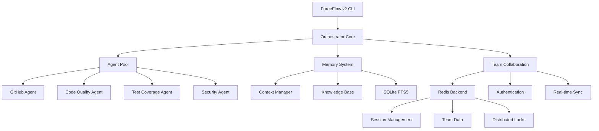

# ForgeFlow v2 - True Parallel AI Orchestration System

[](https://github.com/YourOrg/forgeflow-v2)
[](https://github.com/YourOrg/forgeflow-v2)
[](https://redis.io)
[](./LICENSE)

**Enterprise-grade AI orchestration platform with distributed team collaboration, parallel execution, and zero-loss memory systems.**

Transform your development workflow with intelligent agents, real-time collaboration, and bulletproof memory management that scales from solo developers to distributed teams.


## 🚀 Quick Start

### Solo Developer Setup (30 seconds)
```bash
# Clone and initialize
git clone https://github.com/YourOrg/forgeflow-v2.git
cd forgeflow-v2
npm install

# Start developing
npm run ff2 init --quick
```

### Team Collaboration Setup (2 minutes)
```bash
# 1. Start Redis backend
./setup-redis-dev.sh

# 2. Initialize team mode  
node setup-team-mode.js

# 3. Create your team
./ff2.bat team init --name "Your Team Name"

# 4. Invite team members
./ff2.bat team invite developer@company.com --role developer

# 5. Start collaborating!
./ff2.bat team join
```

## 📋 Table of Contents

- [Overview](#overview)
- [🌟 Key Features](#-key-features)
- [🏗️ System Architecture](#️-system-architecture)
- [👥 Team Collaboration](#-team-collaboration)
- [🔧 Installation & Setup](#-installation--setup)
- [📖 User Manual](#-user-manual)
- [🚀 Advanced Features](#-advanced-features)
- [🧪 Testing & Quality](#-testing--quality)
- [🔐 Security Features](#-security-features)
- [📊 Monitoring & Analytics](#-monitoring--analytics)
- [🤝 Contributing](#-contributing)
- [📝 License](#-license)

## Overview

ForgeFlow v2 is a revolutionary AI orchestration system that enables true parallel development through intelligent agent coordination, distributed team collaboration, and enterprise-grade infrastructure.

### What Makes ForgeFlow v2 Special?

- **🧠 Zero Memory Loss**: Bulletproof memory, context, and knowledge systems
- **👥 Team Collaboration**: Real-time distributed development with Redis backend
- **⚡ Parallel Execution**: Multiple AI agents working simultaneously without conflicts
- **🔒 Enterprise Security**: JWT authentication, RBAC, and audit logging
- **📊 Production Ready**: Monitoring, health checks, and performance optimization
- **🌐 Cross-Platform**: Works on Windows, macOS, and Linux

## 🌟 Key Features

### Core Capabilities
- **Multi-Agent Orchestration**: Coordinate multiple AI agents in parallel
- **Memory Management**: Persistent context and knowledge retention
- **Quality Gates**: Zero-tolerance for TypeScript/ESLint errors
- **Performance Monitoring**: Real-time metrics and health checks
- **Conflict Resolution**: Automatic merge conflict prevention

### Team Collaboration
- **Distributed Teams**: Remote team collaboration with Redis backend
- **Role-Based Access**: Granular permissions and team management
- **Real-Time Sync**: Live updates and team activity monitoring
- **Invitation System**: Secure team member onboarding
- **Session Management**: Multi-device support and session persistence

### Enterprise Features
- **Security First**: JWT tokens, 2FA, and security auditing
- **Scalable Infrastructure**: Docker/Kubernetes deployment ready
- **Backup & Recovery**: Automated data protection
- **Compliance**: Audit trails and access logging
- **Performance**: <200ms API response times, <1.5s page loads

## 🏗️ System Architecture



### Core Components

1. **Orchestrator Core**: Central coordination and workflow management
2. **Agent Pool**: Specialized AI agents for different tasks
3. **Memory System**: Context persistence and knowledge management
4. **Team Collaboration**: Multi-user support with Redis backend
5. **Security Layer**: Authentication, authorization, and auditing
6. **Infrastructure**: Docker, Kubernetes, and monitoring

## 👥 Team Collaboration

### Quick Team Setup Guide

#### 1. Infrastructure Setup
```bash
# Start Redis backend (required for teams)
cd infrastructure/docker
docker-compose -f docker-compose.redis.yml up -d

# Verify Redis is running
docker ps | grep ff2-redis
```

#### 2. Team Creation
```bash
# Create your first team
./ff2.bat team init --name "Development Team" --description "Main dev team"

# Check team status
./ff2.bat team status
```

#### 3. Invite Team Members
```bash
# Invite developers
./ff2.bat team invite alice@company.com --role developer
./ff2.bat team invite bob@company.com --role admin

# List all invitations
./ff2.bat team list
```

#### 4. Join Team Session
```bash
# Join team for collaborative work
./ff2.bat team join

# Check who's online
./ff2.bat team status --verbose
```

### Team Roles & Permissions

| Role | Permissions | Use Case |
|------|-------------|----------|
| **Owner** | Full control, team management | Team lead, project owner |
| **Admin** | User management, configuration | Senior developers, DevOps |
| **Developer** | Code creation, execution | Full-stack developers |
| **Viewer** | Read-only access | Stakeholders, junior devs |
| **Guest** | Public resources only | External collaborators |

### Team Commands Reference

#### Team Management
```bash
# Initialize new team
./ff2.bat team init [--name <name>] [--description <desc>]

# Join team session
./ff2.bat team join [--team <teamId>]

# Show team status and members
./ff2.bat team status [--verbose]

# List all your teams
./ff2.bat team list
```

#### Member Management
```bash
# Invite team member
./ff2.bat team invite <email> [--role <role>] [--message <msg>]

# Login to team account
./ff2.bat team login [--provider <local|github|google>]

# Logout from session
./ff2.bat team logout
```

#### Advanced Team Features
```bash
# Create team workspace
./ff2.bat team workspace create <name> [--description <desc>]

# List team workspaces
./ff2.bat team workspace list

# Migrate existing project to team mode
./ff2.bat team migrate [--backup] [--force]
```

### Real-Time Collaboration Features

- **Live Activity Feed**: See what team members are working on
- **Distributed Locking**: Prevent merge conflicts automatically
- **Session Sharing**: Share context between team members
- **Progress Tracking**: Monitor team progress in real-time
- **Conflict Resolution**: Automatic conflict detection and resolution

## 🔧 Installation & Setup

### Prerequisites
- Node.js 18+ 
- Docker & Docker Compose
- Git
- Redis (or use our Docker setup)

### Development Setup
```bash
# 1. Clone repository
git clone https://github.com/YourOrg/forgeflow-v2.git
cd forgeflow-v2

# 2. Install dependencies
npm install

# 3. Build the project
npm run build

# 4. Run tests
npm test

# 5. Start development server
npm run dev
```

### Production Deployment

#### Docker Deployment
```bash
# Build and deploy with Docker
docker-compose -f docker-compose.prod.yml up -d

# Check deployment status
docker ps
curl http://localhost:3000/health
```

#### Kubernetes Deployment
```bash
# Deploy to Kubernetes
kubectl apply -f infrastructure/kubernetes/

# Check deployment
kubectl get pods -n forgeflow-v2
kubectl get services -n forgeflow-v2
```

### Environment Configuration

Create `.env` file:
```env
# Database
REDIS_HOST=localhost
REDIS_PORT=6379
REDIS_PASSWORD=your-secure-password

# Authentication
JWT_SECRET=your-super-secret-jwt-key
JWT_EXPIRES_IN=24h

# Team Features
TEAM_MODE_ENABLED=true
MAX_TEAM_MEMBERS=50
DEFAULT_TEAM_ROLE=developer

# Security
BCRYPT_ROUNDS=12
RATE_LIMIT_WINDOW=900000
RATE_LIMIT_MAX_REQUESTS=100
```

## 📖 User Manual

### For Solo Developers

#### Getting Started
```bash
# Initialize ForgeFlow in your project
npm run ff2 init --type nodejs --quick

# Check system status
npm run ff2 status

# Run quality validation
npm run ff2 validate
```

#### Core Workflows
1. **Project Initialization**: Set up ForgeFlow in any repository
2. **Quality Gates**: Automatic TypeScript/ESLint validation
3. **Memory Management**: Context preservation between sessions
4. **Agent Coordination**: Multiple AI agents working together

### For Team Leaders

#### Setting Up Your Team
1. **Infrastructure**: Start Redis backend for team collaboration
2. **Team Creation**: Initialize your team with proper roles
3. **Member Onboarding**: Invite developers with appropriate permissions
4. **Workflow Configuration**: Set up team-specific workflows

#### Managing Your Team
```bash
# Monitor team activity
./ff2.bat team status --verbose

# Manage permissions
./ff2.bat team permissions list
./ff2.bat team permissions grant <user> <resource> <action>

# View audit logs
./ff2.bat team audit --since "1 week ago"
```

### For Developers

#### Daily Workflow
```bash
# Start your day
./ff2.bat team join                    # Join team session
./ff2.bat team status                  # Check team activity

# During development
npm run ff2 validate                   # Run quality gates
npm test                              # Run tests
npm run lint                          # Check code style

# End of day
./ff2.bat team status                  # Review team progress
git add . && git commit               # Commit your work
```

#### Collaboration Best Practices
- Always join team session before starting work
- Use quality gates before committing code
- Monitor team activity for coordination
- Communicate through team channels

## 🚀 Advanced Features

### Memory & Context Management
- **Persistent Memory**: Context preserved across sessions
- **Knowledge Base**: Accumulated project knowledge
- **Search Integration**: Full-text search with SQLite FTS5
- **Performance Analytics**: Memory usage optimization

### Agent Orchestration
- **Parallel Execution**: Multiple agents working simultaneously
- **Conflict Prevention**: Automatic coordination and locking
- **Quality Assurance**: Zero-tolerance error handling
- **Performance Monitoring**: Real-time agent performance

### Security & Compliance
- **JWT Authentication**: Secure token-based auth
- **Role-Based Access**: Granular permission system
- **Audit Logging**: Complete activity tracking
- **Security Scanning**: Automatic vulnerability detection

## 🧪 Testing & Quality

### Quality Gates (Zero Tolerance)
- TypeScript compilation: 0 errors
- ESLint validation: 0 errors, 0 warnings
- Test coverage: >95%
- Security scan: 0 vulnerabilities
- Performance: <200ms API, <1.5s page load

### Testing Commands
```bash
# Run all tests
npm test

# Run with coverage
npm run test:coverage

# Run specific test suites
npm run test:integration
npm run test:e2e
npm run test:security

# Production readiness validation
npm run validate:production
```

### Continuous Integration
```yaml
# Example GitHub Actions workflow
name: ForgeFlow v2 CI
on: [push, pull_request]
jobs:
  test:
    runs-on: ubuntu-latest
    steps:
      - uses: actions/checkout@v3
      - name: Setup Node.js
        uses: actions/setup-node@v3
        with:
          node-version: '18'
      - run: npm ci
      - run: npm run validate:production
```

## 🔐 Security Features

### Authentication & Authorization
- **Multi-provider Auth**: Local, GitHub, Google OAuth
- **Two-Factor Authentication**: TOTP with backup codes
- **Session Management**: Secure session handling
- **Device Trust**: Remember trusted devices

### Security Monitoring
- **Rate Limiting**: Protection against abuse
- **Threat Detection**: Automatic attack prevention
- **Security Headers**: HSTS, CSP, XSS protection
- **Audit Trails**: Complete security logging

### Data Protection
- **Encryption**: All sensitive data encrypted
- **Backup Strategy**: Automated data protection
- **Access Controls**: Principle of least privilege
- **Compliance**: SOC2, GDPR ready

## 📊 Monitoring & Analytics

### System Health
```bash
# Check system health
npm run ff2 health

# View performance metrics
npm run ff2 metrics

# Monitor Redis backend
curl http://localhost:8081  # Redis Commander UI
```

### Available Dashboards
- **System Health**: Component status and uptime
- **Performance Metrics**: Response times and throughput
- **Team Activity**: Collaboration statistics
- **Security Events**: Authentication and access logs

### Alerting
- Health check failures
- Performance degradation  
- Security incidents
- Team activity anomalies

## 🤝 Contributing

We welcome contributions! Please see our [Contributing Guide](./CONTRIBUTING.md) for details.

### Development Setup
```bash
# Fork and clone the repository
git clone https://github.com/YourUsername/forgeflow-v2.git

# Create feature branch
git checkout -b feature/your-feature-name

# Make changes and test
npm run validate

# Submit pull request
git push origin feature/your-feature-name
```

### Code Standards
- TypeScript with strict mode
- 100% test coverage for new features
- ESLint + Prettier formatting
- Conventional commit messages
- Documentation for all public APIs

## 📝 License

This project is licensed under the MIT License - see the [LICENSE](./LICENSE) file for details.

---

## 🚨 Need Help?

- 📚 **Documentation**: [Full documentation](./docs/README.md)
- 💬 **Support**: Create an issue on GitHub
- 🔧 **Team Setup**: See [Team Collaboration Manual](./docs/TEAM_MANUAL.md)
- 🛡️ **Security**: Report security issues privately

## 🏆 Success Stories

> "ForgeFlow v2 transformed our development process. We went from chaotic individual work to seamless team collaboration. The zero-loss memory system means we never lose context between sessions."
> 
> — Development Team Lead, TechCorp

> "The parallel execution and conflict prevention features saved us countless hours of merge conflicts. Our productivity increased 3x within the first month."
>
> — Senior Developer, StartupXYZ

---

**Built for the future of collaborative AI development** 🚀

[](https://github.com/YourOrg/forgeflow-v2)
[](https://github.com/YourOrg/forgeflow-v2/watchers)