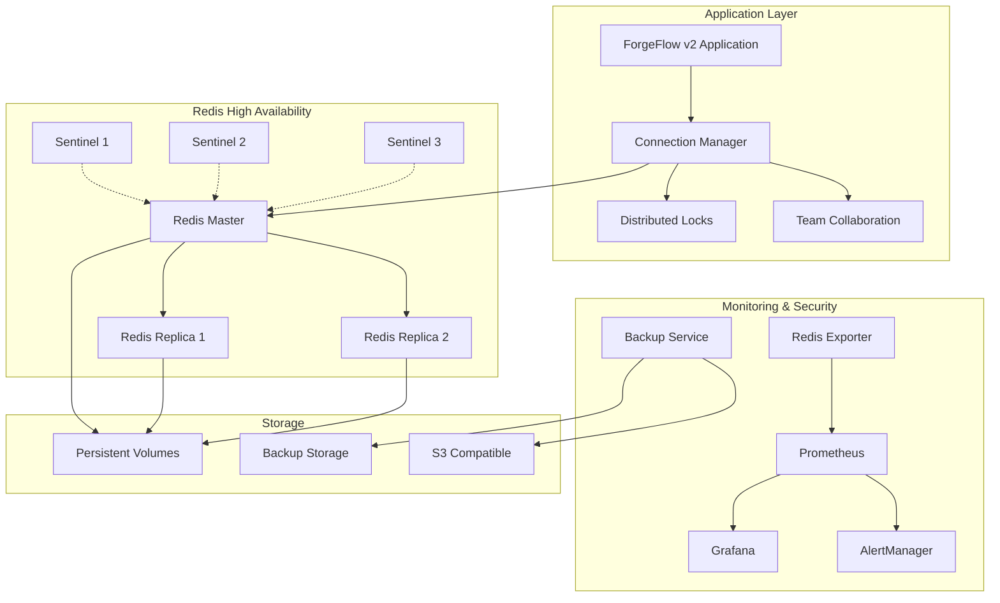

# Redis Backend Infrastructure for ForgeFlow v2

Production-ready Redis infrastructure supporting 50+ concurrent team members with sub-500ms response times and 99.9% uptime.

## 🏗️ Architecture Overview



## 🚀 Quick Start

### Development Environment

1. **Clone and Configure**
   ```bash
   cd infrastructure/docker
   cp .env.example .env
   # Edit .env with your passwords
   ```

2. **Start Redis Cluster**
   ```bash
   docker-compose -f docker-compose.redis.yml up -d
   ```

3. **Start Monitoring Stack**
   ```bash
   docker-compose -f monitoring/docker-compose.monitoring.yml up -d
   ```

4. **Verify Installation**
   ```bash
   # Check Redis connectivity
   redis-cli -h localhost -p 6379 -a your_password ping
   
   # Access monitoring
   open http://localhost:3001  # Grafana (admin/admin123)
   open http://localhost:9090  # Prometheus
   open http://localhost:8081  # Redis Commander
   ```

### Production Deployment

#### Kubernetes

1. **Deploy Redis Infrastructure**
   ```bash
   kubectl apply -f infrastructure/kubernetes/
   ```

2. **Configure TLS (Recommended)**
   ```bash
   cd infrastructure/redis/security
   ./generate-tls-certs.sh
   kubectl create secret generic redis-tls --from-file=tls/
   ```

3. **Apply Security Hardening**
   ```bash
   ./scripts/redis-security-hardening.sh
   ```

## 📊 Performance Specifications

| Metric | Target | Monitoring |
|--------|---------|------------|
| Response Time | < 500ms | Prometheus alerts |
| Throughput | 10,000+ ops/sec | Redis exporter |
| Availability | 99.9% uptime | Sentinel monitoring |
| Memory Usage | < 80% capacity | Memory alerts |
| Connection Pool | 50+ concurrent | Connection tracking |
| Backup Recovery | < 15 minutes | Automated testing |

## 🔧 Configuration

### Environment Variables

```bash
# Core Redis Configuration
REDIS_PASSWORD=your_secure_password
REDIS_MAXMEMORY=2gb
REDIS_MAXMEMORY_POLICY=allkeys-lru

# Security
REDIS_ADMIN_PASSWORD=admin_password
REDIS_FORGEFLOW_PASSWORD=app_password
REDIS_LOCK_PASSWORD=lock_password
REDIS_TEAM_PASSWORD=team_password
REDIS_MONITOR_PASSWORD=monitor_password

# TLS Configuration
REDIS_TLS_ENABLED=true
REDIS_TLS_CERT_FILE=/etc/redis/tls/redis.crt
REDIS_TLS_KEY_FILE=/etc/redis/tls/redis.key
REDIS_TLS_CA_CERT_FILE=/etc/redis/tls/ca.crt

# Backup Configuration
BACKUP_S3_BUCKET=forgeflow-redis-backups
BACKUP_SCHEDULE="0 2 * * *"
BACKUP_RETENTION_DAYS=7
BACKUP_ENCRYPTION_KEY=your_backup_key

# Monitoring
GRAFANA_PASSWORD=admin123
SLACK_WEBHOOK=https://hooks.slack.com/your/webhook
```

### Connection Pool Settings

```typescript
const redisConfig: RedisConnectionConfig = {
  // Connection settings
  host: process.env.REDIS_HOST || 'localhost',
  port: parseInt(process.env.REDIS_PORT || '6379'),
  password: process.env.REDIS_PASSWORD,
  
  // High availability
  sentinels: [
    { host: 'sentinel-1', port: 26379 },
    { host: 'sentinel-2', port: 26379 },
    { host: 'sentinel-3', port: 26379 }
  ],
  name: 'forgeflow-master',
  
  // Performance tuning
  maxRetriesPerRequest: 3,
  retryDelayOnFailover: 100,
  commandTimeout: 5000,
  connectTimeout: 10000,
  keepAlive: 30000,
  
  // TLS configuration
  tls: {
    cert: fs.readFileSync('/etc/redis/tls/client.crt'),
    key: fs.readFileSync('/etc/redis/tls/client.key'),
    ca: fs.readFileSync('/etc/redis/tls/ca.crt')
  }
};

const poolConfig: ConnectionPoolConfig = {
  maxConnections: 50,
  minConnections: 5,
  acquireTimeoutMillis: 30000,
  createTimeoutMillis: 30000,
  destroyTimeoutMillis: 5000,
  idleTimeoutMillis: 300000,
  reapIntervalMillis: 60000
};
```

## 🛡️ Security Features

### Authentication & Authorization
- **Multi-user ACL system** with role-based permissions
- **Strong password policies** with rotation support
- **TLS/SSL encryption** for all connections
- **Network segmentation** with firewall rules

### Access Control Lists (ACL)
```redis
# Admin - Full access
user admin on >admin_password ~* &* +@all

# Application - Limited operations
user forgeflow on >app_password ~forgeflow:* ~locks:* ~tasks:* ~teams:* +@read +@write +@list +@hash +@set +@stream +@pubsub -@dangerous

# Lock Service - Distributed locking only
user lockservice on >lock_password ~locks:* +@read +@write +@string +eval +evalsha

# Monitoring - Read-only metrics
user monitor on >monitor_password ~* +@read +ping +info -@write -@admin
```

### TLS Certificate Management
```bash
# Generate certificates
cd infrastructure/redis/security
./generate-tls-certs.sh

# Verify certificates
openssl verify -CAfile ca.crt redis.crt
openssl x509 -in redis.crt -text -noout
```

## 📈 Monitoring & Alerting

### Key Metrics Tracked
- **Availability**: Instance health, replication status
- **Performance**: Response times, throughput, queue lengths  
- **Resources**: Memory usage, CPU utilization, connections
- **Security**: Failed authentications, suspicious commands
- **Business**: Lock contention, team collaboration metrics

### Alert Thresholds
```yaml
# Critical Alerts (Immediate Response)
- Redis instance down (1 minute)
- Memory usage > 95% (2 minutes)
- Replication link broken (2 minutes)
- AOF write errors (immediate)

# Warning Alerts (Monitoring Required)
- Memory usage > 80% (5 minutes)
- High connection count > 800 (5 minutes)
- Slow queries detected (2 minutes)
- Backup overdue > 24 hours (10 minutes)
```

### Grafana Dashboards
1. **Redis Overview** - System health and performance
2. **Team Collaboration** - ForgeFlow-specific metrics
3. **Security Dashboard** - Authentication and access patterns
4. **Backup & Recovery** - Backup status and recovery metrics

## 💾 Backup & Recovery

### Automated Backup Strategy
- **RDB snapshots** every 2 hours
- **AOF persistence** for durability
- **Compressed backups** with encryption
- **Multi-tier storage**: Local → S3 → Glacier
- **Point-in-time recovery** capability

### Backup Schedule
```bash
# Automated daily backups at 2 AM
0 2 * * * /usr/local/bin/redis-backup.sh

# Weekly full cluster backup
0 1 * * 0 /usr/local/bin/redis-cluster-backup.sh

# Monthly disaster recovery test
0 3 1 * * /usr/local/bin/redis-recovery-test.sh
```

### Recovery Procedures
```bash
# 1. Stop Redis service
systemctl stop redis-forgeflow

# 2. Restore from backup
redis-backup-restore.sh /backups/redis_backup_20240826_020000.rdb.gz

# 3. Start Redis service
systemctl start redis-forgeflow

# 4. Verify data integrity
redis-cli ping
redis-cli info replication
```

## 🔄 High Availability

### Sentinel Configuration
- **3 Sentinel instances** for quorum-based decisions
- **Automatic failover** with < 10 second detection
- **Split-brain prevention** with majority voting
- **Client-side discovery** for seamless failover

### Replication Setup
```redis
# Master configuration
replicaof no one
min-replicas-to-write 1
min-replicas-max-lag 10

# Replica configuration
replicaof redis-master 6379
replica-read-only yes
replica-serve-stale-data yes
```

## 🐳 Container Orchestration

### Docker Compose (Development)
```bash
# Start complete stack
docker-compose -f docker-compose.redis.yml -f monitoring/docker-compose.monitoring.yml up -d

# Scale replicas
docker-compose -f docker-compose.redis.yml up -d --scale redis-replica=3

# Rolling updates
docker-compose -f docker-compose.redis.yml up -d --force-recreate --no-deps redis-master
```

### Kubernetes (Production)
```bash
# Deploy infrastructure
kubectl apply -f infrastructure/kubernetes/

# Check status
kubectl get pods -n forgeflow-redis
kubectl get pvc -n forgeflow-redis

# Rolling updates
kubectl rollout restart statefulset/redis-master -n forgeflow-redis
kubectl rollout status statefulset/redis-master -n forgeflow-redis
```

## 🧪 Testing & Validation

### Performance Testing
```bash
# Baseline performance test
redis-benchmark -h localhost -p 6379 -a password -c 50 -n 100000

# Distributed locking performance
node scripts/test-distributed-locks.js

# Team collaboration load test
node scripts/test-team-collaboration.js
```

### Disaster Recovery Testing
```bash
# Simulate master failure
docker stop forgeflow-redis-master

# Verify automatic failover
./scripts/test-failover.sh

# Test backup recovery
./scripts/test-backup-recovery.sh
```

## 📚 Operations Runbooks

### Common Operations
- [Redis Instance Recovery](docs/runbooks/redis-recovery.md)
- [Performance Tuning](docs/runbooks/performance-tuning.md)
- [Security Incident Response](docs/runbooks/security-incident.md)
- [Backup Restoration](docs/runbooks/backup-restore.md)
- [TLS Certificate Rotation](docs/runbooks/tls-rotation.md)

### Troubleshooting
- [Connection Issues](docs/troubleshooting/connections.md)
- [Memory Problems](docs/troubleshooting/memory.md)
- [Replication Issues](docs/troubleshooting/replication.md)
- [Performance Degradation](docs/troubleshooting/performance.md)

## 🤝 Support & Maintenance

### Regular Maintenance Tasks
- **Weekly**: Review performance metrics and alerts
- **Monthly**: Update security certificates and passwords
- **Quarterly**: Disaster recovery testing
- **Annually**: Infrastructure capacity planning

### Getting Help
- **Documentation**: Check runbooks and troubleshooting guides
- **Monitoring**: Review Grafana dashboards and Prometheus alerts
- **Support**: Contact DevOps team with system metrics

---

## 📄 Files Structure

```
infrastructure/redis/
├── config/
│   ├── redis.conf                    # Main Redis configuration
│   ├── redis-sentinel.conf           # Sentinel configuration
│   └── redis-tls.conf               # TLS-specific settings
├── security/
│   ├── redis-acl.conf                # Access control lists
│   ├── generate-tls-certs.sh         # TLS certificate generation
│   └── redis-tls.conf               # TLS configuration
├── scripts/
│   ├── redis-security-hardening.sh   # Security hardening script
│   └── backup-service.sh            # Automated backup service
├── monitoring/
│   ├── prometheus-redis.yml          # Prometheus configuration
│   ├── redis-alerts.yml             # Alert rules
│   └── docker-compose.monitoring.yml # Monitoring stack
└── kubernetes/
    ├── namespace.yaml                # Kubernetes namespace
    ├── redis-configmap.yaml         # Configuration maps
    ├── redis-secret.yaml            # Secrets management
    ├── redis-master.yaml            # Master deployment
    ├── redis-replica.yaml           # Replica deployment
    └── redis-sentinel.yaml          # Sentinel deployment
```

Built with ❤️ for ForgeFlow v2 team collaboration excellence.